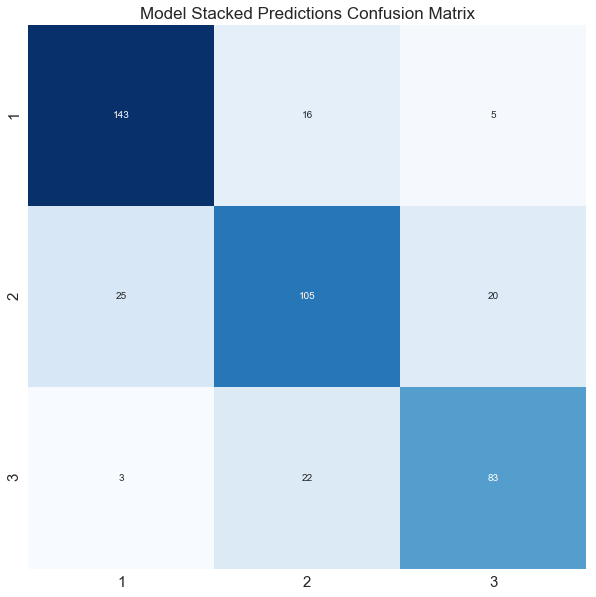

# Corporate Credit Risk Classification Model
Objective: To build a multi-class classification model that predicts corporate credit risk levels using credit ratings as labels. 

Blog: https://janabdullah96.medium.com/corporate-credit-risk-classification-model-9db86e3f2e4e

## Repo Contents

**Python Modules**
(in 'module3_scripts' folder)
1. cleaner.py - contains functionality for displaying data diagnostic reports with respect to data cleaning, and perform cleaning actions.
2. seperator.py - contains functionality to split and classify variables into their respective categories (i.e. dependent, continuous, categorical, binary etc.)
3. preprocessor.py - contains functionality for transforming variables to prepare them for modeling (i.e. standardization, one-hot encoding etc.)
4. model.py - contains functionality for running and evaluating sklearn classifiers, as well as functionality for model stacking and stacked model evaluation.

**Jupyter Notebooks**
1. data_cleaning.ipynb - in this notebook the raw input data is formatted and cleaned. 
2. additional_data_compilation.ipynb - in this notebook we take the cleaned dataframe and add some reference data from outside sources to enrich the model (observed ~+3.1% increase in stacked model performance with additional features). 
3. EDA.ipynb - in this notebook we focus on a few features from our overall compiled dataset and perform EDA. We zoom into the behavior of a few trends/patterns in our data and cross-validate against prior knowledge on corporate credit risk determination. 
4. pre-processing.ipynb - in this notebook we prepare the dataset for modeling. Here, we perform train-test split, standardization, one-hot encoding, and SMOTE resampling.
5. modeling.ipynb - in this notebook we perform the actual modeling. We run vanilla sklearn classification algorithms on our dataset, and then select a few classifiers to perform hyperparameter tuning on and subsequently add to the model stack. We then run the ensemble model and evaluate its performance. 

**Other**
1. The 'input_datasets' folder contains all the non-API retrieved input data used in this project.
2. The 'working_datasets' folder contains some datasets generated and used in this project.
3. The 'pkl' folder contains pickle files generated and used in this project.

## The Final Model

The final model applies hyper-parameter tuning to the Bootstrap Aggregation, Random Forest, Gradient Boosting, and XGBoost classifiers, and appends these to a model stack.

**Stacked Model Score: 78.44%**

**Unacceptable Error: 1.90%**

**Best Individual Baseline Classifier Score: 76.07%**

**Best Individual Parameter-tuned Classifier Score: 77.96%**

**Baseline Score: 38.86%**

**Random Guessing Score: 33.33%**

*Unacceptable error is when the model makes a certain class prediction, but the actual class value is on the other end of the spectrum. I.e the model predicts a certain company's credit to be low risk when it is actually high, or vice versa.*

*1 - high risk*

*2 - medium risk*

*3 - low risk*

## Future Work

This entire project was an iterative process in many different aspects, i.e. trying out different dataset cleaning configurations, split sizes, model stacks, grid search parameters etc. Continued time and resources applied to research on finding the optimal configurations for all aspects of the project would surely improve the model. Other things that can help are higher computational/processing power to be able to scale the size of iterations, sourcing more data, enlisting the help of others to delegate tasks and focuses (making this a group project) etc. 
